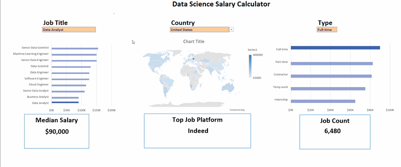
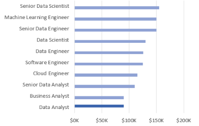
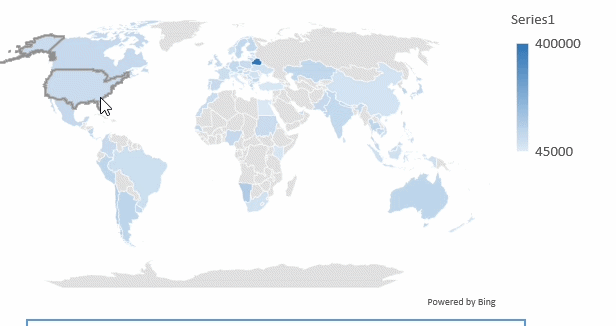
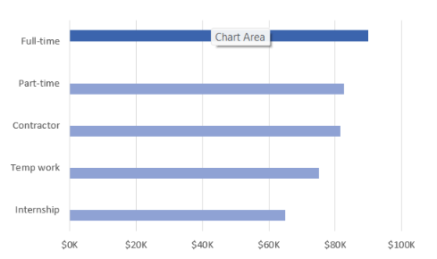
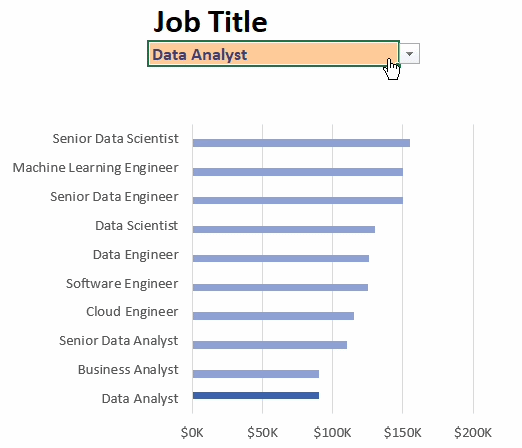

# Excel Salary Dashboard

## Introduction

This project is an interactive **Excel Salary Dashboard** created to analyze salary information from a real-world job-posting dataset.

The dashboard allows users to interactively select:

- **Job Title**
- **Country**
- **Job Schedule Type**

The dashboard updates its calculations and visualizations based on the selected criteria.

The main goal of this project was to practice **Excel data analysis, formulas, data validation, dashboard design, and data visualization** using a large job-posting dataset.

---

## Dashboard

The dashboard provides an interactive way to explore salary information across different job titles, countries, and job schedule types.

### Salary by Job Title

This section compares salary information across different job titles.

The calculations are performed in the `title` worksheet and are connected to the dashboard.

### Salary by Country

This section compares salary information across different countries.

The calculations are performed in the `country` worksheet and are connected to the dashboard.

### Job Schedule Type

The dashboard also allows users to analyze salary information based on different job schedule types.

The calculations are performed in the `type` worksheet and are connected to the dashboard.

---

## Interactive Features

The dashboard uses **Data Validation dropdowns** to allow users to change the analysis without manually editing formulas.

The available selections include:

- Job Title
- Country
- Job Schedule Type

### Why Data Validation?

Data Validation was used to:

- Create interactive dropdown menus
- Restrict users to predefined selections
- Reduce manual input errors
- Allow the dashboard to update dynamically

---

## Excel Skills Used

The project demonstrates the following Excel skills:

- Data Cleaning and Organization
- Data Validation
- XLOOKUP
- COUNTIFS
- IF Functions
- Dynamic Arrays
- Excel Tables
- Charts
- Dashboard Design
- Data Visualization

---

## Formulas and Functions

### XLOOKUP

XLOOKUP is used to retrieve information based on a selected value.

Example:

    =XLOOKUP(title,D2:D11,E2:E11,"Not Result")

### Purpose

- Searches for a specific value
- Returns the corresponding result
- Provides a fallback value if no match is found

### COUNTIFS

COUNTIFS is used to count job postings that meet multiple conditions.

Example:

    =COUNTIFS(jobs[job_via],A2,jobs[job_title_short],title,jobs[job_country],country,jobs[job_schedule_type],type)

This allows the dashboard to count job postings based on multiple selected criteria.

### Criteria Used

- Job platform
- Job title
- Country
- Job schedule type

### IF Functions

IF functions are used in the supporting calculations to control which values are displayed based on the dashboard selections.

This helps the dashboard dynamically determine which information should be displayed.

---

## Dataset

The dataset contains job-posting information from **2023**.

The dataset includes information such as:

- Job titles
- Salaries
- Countries
- Job schedule types
- Companies
- Job platforms
- Work-from-home information
- Other job-related information

The dataset serves as the foundation for the dashboard calculations and visualizations.

---

## Workbook Structure

The workbook contains several worksheets, with each worksheet serving a specific purpose.

    Project_1_salary_dashboard.xlsx
    │
    ├── Data
    ├── validation
    ├── salary_calculator
    ├── title
    ├── country
    ├── type
    └── platform

### Data

Contains the underlying job-posting dataset used for the analysis.

### validation

Contains the lists used to create the interactive dropdown selections.

### salary_calculator

Contains the main dashboard and connects the user selections with the supporting calculations.

### title

Contains calculations related to salary information by job title.

### country

Contains calculations related to salary information by country.

### type

Contains calculations related to job schedule types.

### platform

Contains calculations used to analyze the number of matching job postings by platform.

---

## Dashboard Demonstration

The GIF below demonstrates the interactive nature of the dashboard and how the results change when different selections are made.

---

## What I Learned

Through this project, I practiced:

- Building an interactive Excel dashboard
- Creating dropdown menus using Data Validation
- Using XLOOKUP for lookups
- Using COUNTIFS for multi-criteria analysis
- Using IF functions
- Working with Excel Tables
- Organizing supporting calculation worksheets
- Connecting calculations to charts
- Designing an interactive dashboard
- Presenting data in a clear and visual format

---

## Project File

The complete interactive Excel workbook is available here:

[Download Project_1_salary_dashboard.xlsx](Project_1_salary_dashboard.xlsx)

---

## Tools Used

**Microsoft Excel**

### Skills

`Excel` `XLOOKUP` `COUNTIFS` `IF` `Data Validation` `Charts` `Data Analysis` `Dashboard Design`

---

## Conclusion

This project demonstrates how Excel can be used to transform job-posting data into an interactive salary analysis dashboard.

By combining **formulas, Data Validation, supporting calculation worksheets, and charts**, the dashboard allows users to explore salary information based on different job-related criteria.

